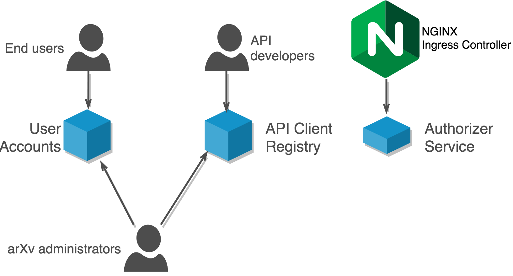

.. _index:

arXiv Authorization & Authentication
====================================

The accounts and authorization subsystem is responsible for providing user
accounts and profiles as well as mechanisms for authentication and
authorization. This subsystem also provides the API client portal, which
supports generation of application tokens, OAuth2 workflows, and a public
API client application portal that end-users can use to discover tools and
services built on top of arXiv APIs.

The arXiv platform provides both anonymous and authenticated interfaces to
end-users (including moderators), API clients, and the arXiv operations team.
This project provides applications and libraries to support authentication and
authorization, including account creation and login, user sessions, and API
token management. TLS is considered an infrastructure concern, and is therefore
out of scope (albeit critical) for this project.

Objectives & Requirements
-------------------------

1. Users must be able to register for and log in to the arXiv site, and
   interact with parts of the platform that require authentication, and do
   so securely.
2. Once logged in, a user should be able to access services/endpoints for which
   they are authorized regardless of where that service is deployed.
3. API clients must be able to authenticate with the arXiv site, and obtain
   secure authorization tokens using OAuth2 protocols.
4. Administrators must be able to grant and revoke authorization for specific
   actions and services within the arXiv platform, using a role-based system.
5. It must be possible to revoke access from a user or client, and have that
   revocation take effect immediately.
6. Accessing authentication and authorization information in an arXiv
   service/application must not require implementing new integrations; we need
   a single, consistent solution for authn/z concerns in Flask applications.
7. Services/applications deployed in the cloud must be able to obtain authn/z
   information without accessing a central database. Services/applications
   deployed on-premises must integrate with the legacy database so that users
   can seamlessly move between legacy and NG interfaces using the same session.

Services
--------
The objectives above are separated into four distinct concerns, each addressed
by a separate piece of software.

.. _figure-authnz-context:

   System context for authn/z services in arXiv.

:mod:`arxiv.users` Package
    A Python library that provides middleware and other components for working
    with user/client sessions and authorization in arXiv services.
:mod:`Accounts Service <accounts>`
    Provides user registration and login mechanisms, access control management,
    and user profiles.
:mod:`Authentication Service <authenticator>`
    Handles authentication subrequests from ingress controllers. Validates
    user session keys and API access keys, and generates internal authorization
    tokens.
:mod:`API Client Registry <registry>`
    Provides API client/application registration, generation of client keys,
    and a public-facing searchable directory of client projects and services.
    Also provides API documentation.

The accounts and authenticator services are underlain by a **distributed
keystore** (HA Redis cluster) for registration and validation of session and
access keys.

Cross-Cutting Concerns
----------------------
Role-Based Access Control
^^^^^^^^^^^^^^^^^^^^^^^^^
Access control addresses what users are authorized to access and what users are
authorized to do in the system. The classic arXiv system uses an access control
mechanism similar to the Discretionary Access Control model, in which an Access
Control List specifies what individual users can do in specific areas of the
system and in relation to specific resources. DAC/ACL systems are often
sufficient for systems with a relatively small number of users, but become
difficult to manage as the user base grows or the system becomes more complex.

The NG architecture adopts Role-Based Access Control, in which authorizations
accrue instead to abstract "roles" to which multiple users belong. For example,
several users might belong to a "moderator" role, to which specific
authorizations (e.g. "can propose subject classifications",
"can view the moderator interface") are attached. The main advantage of RBAC
is ease of administration: policies can be added to and removed from roles
without consideration of the specific users impacted; users can be granted
a specific set of authorizations by simply adding them to a role, rather than
attaching an array of individual policies directly to the user.

.. toctree::
   :maxdepth: 2
   :caption: Contents:

   threats.rst
   arxiv.users/arxiv.users.rst
   accounts/accounts.rst
   authenticator/authenticator.rst
   registry/registry.rst

Indices and tables
==================

* :ref:`genindex`
* :ref:`modindex`
* :ref:`search`
